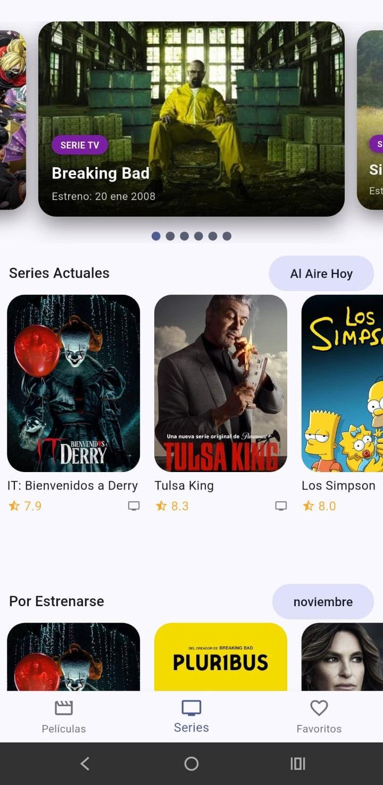

# 📊 Informe de Progreso — Examen Práctico Unidad 2  
**Materia:** Desarrollo Móvil Integral  
**Aplicación:** *Cinemapedia*  
**Modalidad:** Trabajo independiente por contingencia climática  
**Fecha de entrega:** Jueves 14 de noviembre de 2025  
**Repositorio:** https://github.com/Alex01Dev/DMI_ExamenU2-220419.git  

---

## 🗓️ 1. Situación General
Debido a la suspensión temporal de clases presenciales ocasionada por la contingencia climática, se continuó el desarrollo del examen práctico correspondiente a la Unidad 2 mediante trabajo autónomo, apoyado por herramientas de Inteligencia Artificial.  
El presente informe describe las actividades realizadas, los cambios registrados en el repositorio y las evidencias visuales del avance del proyecto.

---

## 👨‍🎓 2. Datos del Estudiante
- **Nombre:** Alex Amauri Marquez Canales  
- **Matrícula:** 2204109
- **Grupo:** Décimo "B"  
- **Repositorio privado:** https://github.com/Alex01Dev/DMI_ExamenU2-220419.git 
- **Versión del proyecto:** `v1.0-examen`  
- **Último commit:** `docs: actualizar README con reporte de avance completo`  

---

## ⚙️ 3. Actividades Realizadas Durante la Contingencia

| Fecha | Actividad | Descripción | Evidencia |
|------|----------|-------------|----------|
| 12/11/2025 | Inicialización del proyecto | Se creó el repositorio a partir de la Práctica 05, se configuró la API de TMDB y se realizó el primer push al repositorio remoto. | Commit inicial + Captura 1 |
| 12/11/2025 | Desarrollo del Splash Screen | Implementación de una pantalla de inicio con animaciones FadeIn y ZoomIn usando animate_do, imagen vertical personalizada y audio de bienvenida mediante audioplayers. Se agregó navegación automática al HomeScreen tras 3 segundos. | Commit Splash Screen + Captura 2 |
| 12/11/2025 | Loader progresivo | Rediseño completo del FullscreenLoader mostrando porcentaje dinámico de carga (0%–100%) con LinearProgressIndicator animado, sincronizado con los providers. Se aplicó un diseño moderno con gradientes. | Commit Loading Screen + Captura 3 |
| 12/11/2025 | Mejoras visuales en el Swiper | Se añadieron elementos informativos al Swiper: título, fecha de estreno con intl, etiqueta visual de clasificación (P, PG, PG-13, R) con colores distintivos y gradiente de fondo para mejorar legibilidad. | Commit Swiper mejorado + Captura 4 |
| 16/11/2025 | Ajustes finales de películas | Corrección del orden por fecha en películas mexicanas, eliminación del subtítulo en la sección Populares y aplicación de un filtro por mes actual en Upcoming. | Commit de ajustes |
| 16/11/2025 | Implementación del módulo de Series | Desarrollo completo del apartado de series de TV, incluyendo arquitectura limpia (entities, datasources, repositories, mappers, providers), widgets personalizados y pantalla principal con cinco secciones. Integración completa en el BottomNavigationBar. | Commit Series TV |

---

## 📝 4. Registro de Commits Importantes

| Estado | Descripción del Commit | Fecha |
|------|------------------------|-------|
| ✅ | feat: splash screen animado con audio | 12/11/2025 |
| ✅ | feat: loader progresivo con porcentaje visible | 12/11/2025 |
| ✅ | feat: mejoras visuales del swiper | 12/11/2025 |
| ✅ | docs: reporte de avance en README | 12/11/2025 |
| ✅ | fix: correcciones en secciones de películas | 16/11/2025 |
| ✅ | feat: implementación completa de Series TV | 16/11/2025 |
| ✅ | chore: creación de iconos launcher multiplataforma | 16/11/2025 |

---

## 🖼️ 5. Evidencia Gráfica

| Pantalla | Descripción | Imagen |
|--------|-------------|--------|
| Splash Screen | Pantalla inicial con animación, logo y sonido de bienvenida |  |
| Loading Screen | Barra de progreso con porcentaje dinámico de carga |  |
| Swiper Principal | Visualización de películas con información contextual |  |
| Series TV | Vista principal del módulo de series con múltiples categorías |  |
| Categorías Series | Organización detallada de series por sección |  |

> 📎 Las capturas se encuentran almacenadas dentro del repositorio.

---

## 🧠 6. Apoyo de Inteligencia Artificial

### Funcionalidades desarrolladas con asistencia de IA:
- Creación del **Splash Screen** con animaciones personalizadas  
- Integración de audio con **audioplayers**  
- Desarrollo del **Loader progresivo** con porcentaje dinámico  
- Optimización visual del **Swiper**  
- Implementación de etiquetas de clasificación por color  
- Formateo de fechas en español usando **intl**  
- Apoyo en la documentación del proyecto  

Los prompts y resultados generados se documentan en el archivo [Evidencia.md](imgs/Evidencia.md).

---

## 🧩 7. Pendientes
- [✔️] Agregar animaciones con Lottie en el Splash Screen  
- [ ] Finalizar sección de Series Populares  
- [ ] Documentar nuevas dependencias  
- [ ] Grabar demostración en video de la app  

> ✅ *Marca las actividades completadas.*

---

## 📝 8. Reflexión Final

Durante este periodo de contingencia climática fue necesario trabajar de forma independiente y organizada. Uno de los mayores retos fue coordinar el avance del porcentaje de carga con los providers manejados mediante Riverpod. Gracias al apoyo de la Inteligencia Artificial, fue posible implementar características avanzadas como animaciones con audio, loaders progresivos y mejoras visuales en la presentación de películas. Como mejora futura, se planea terminar por completo el módulo de series y optimizar los filtros conforme a los criterios del examen final.

---

**📅 Última actualización:** 12 de noviembre de 2025  
**👨‍💻 Autor:** Alex Amauri Marquez Canales — 220419
